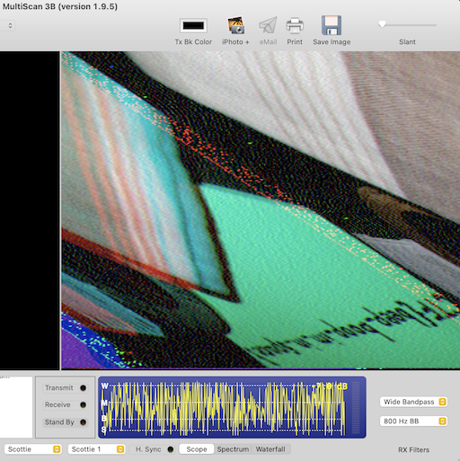

Apollo Missions used [SSTV for Video Transmission](https://en.wikipedia.org/wiki/Slow-scan_television).
*SSTV systems operate on voice frequencies*, which matches the source audio recording.

- There is a tool on Mac OS that allows to receive SSTV images:
  [KD6CJI MULTISCAN 3B SSTV](https://www.qsl.net/kd6cji/)
- Hint: "What is the CMU mascot?, that might help select a RX option":
- *Scotty the Scottie Dog* -> RX: Scottie 1

The output image:

- Flag: `picoCTF{beep_boop_im_in_space}`
